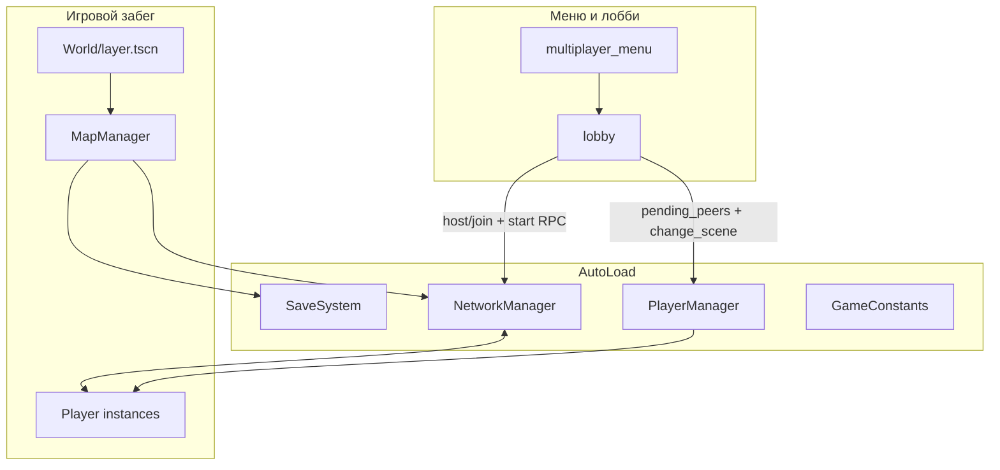

# Dungeon — архитектура проекта (материал для презентации)

Краткий технический обзор **Godot 4.4**, проект **Dungeon** (`config/name` в `project.godot`). Цель документа — дать структуру для слайдов «как устроено изнутри».

## Главный акцент для защиты и слайдов: **настоящий онлайн**

Это не «потом прикрутим сеть», а **центральная ось продукта**: полноценный **мультиплеер по ENet** с лобби, хостом как сервером, синхроном процедурного данжа у всех клиентов, общими переходами между этажами, авторитетным уроном и репликацией врагов. С точки зрения архитектуры **NetworkManager** и **PlayerManager** — такие же несущие автозагрузки, как сохранения и константы. Формулировка для слайда: *«Roguelike, в который реально можно зайти вдвоём–ввосьмером > вместе пройти один и тот же сгенерированный этаж > без рассинхрона карты и лута»*.

---

## 1. Стек и платформа

| Параметр | Значение |
|----------|----------|
| Движок | Godot 4.4 |
| Целевые фичи проекта | `4.4`, **Mobile** |
| Сеть | **ENet** (`ENetMultiplayerPeer`) — **реальный мультиплеер**, не hot-seat |
| Растягивание UI | `viewport` (базовый вьюпорт 540×260, переопределение окна до 1600×800) |
| Ввод | Клавиатура + мышь; `emulate_touch_from_mouse` для отладки тача |

---

## 2. Автозагрузки (singletons)

Центральные подсистемы подключаются как **AutoLoad** и задают «скелет» приложения:

- **GameConstants** — прогресс, статы игрока, размеры комнат/коридоров, баланс врагов; часть значений читается/пишется в `user://game_consts.cfg`.
- **SaveSystem** — `save_game.dat`, `dungeon_state.dat`, артефакты, люк босса, позиция/здоровье.
- **AudioManager** — звуковое сопровождение (SFX по событиям, например переход этажа).
- **NetworkManager** — ENet, RPC, синхрон данжа, кооп-переходы, урон, враги, артефакты.
- **PlayerManager** — словарь игроков по `peer_id`, спавн, финальная расстановка в стартовой комнате коопа, вспомогательная логика ИИ (ближайшая цель, телепорт в бой).
- **LocalizationManager** — локализация; в проекте подключены переводы **ru**, **en**, **az**.

На слайде: «одна сцена игры + автозагрузки = единая точка правды для прогресса и сети».

---

## 3. Высокоуровневая схема потоков (онлайн в центре)

- **Лобби** (`World/UI/lobby.gd`): хост показывает **код комнаты** (кодирование локального IPv4), гость присоединяется; старт игры — RPC с списком пиров и снимком `GameConstants` для единого старта коопа.
- **Игра** (`World/layer.tscn`): содержит **MapManager**, который либо **генерирует** данж, либо **загружает** сохранённое состояние, либо на клиенте **ждёт синхрон** от хоста.

---

## 4. Карта и процедурность (MapManager)

Файл: `World/map_manager.gd` (нода в группе `map_manager`).

- **Типы комнат**: старт, обычные, босс, сокровищница; варианты сцен задаются экспортами (`PackedScene` массивы).
- **Сетка**: параметры из `GameConstants` (`MAP_MANAGER_GRID_SIZE`, размеры комнаты, длина коридора).
- **Коридоры**: отдельные сцены горизонтальный/вертикальный.
- **Препятствия**: пул камней с размерами; уровень детализации препятствий учитывается при генерации/загрузке (`OBSTACLE_DETAIL_LEVEL` / override).
- **Враги и лут**: спавн после физики; для сокровищницы — **«колода» предметов** (`item_draw_pile`), чтобы выдача была контролируемой.
- **Seed**: `generation_seed` для воспроизводимости при сохранении/загрузке данжа.
- **Миникарта**: сигнал `room_changed`, массивы посещённых/«видимых» комнат.

**Сохранение данжа**: сериализация в `dungeon_state.dat` через `SaveSystem`; при выходе из окна — автосейв (`NOTIFICATION_WM_CLOSE_REQUEST`).

---

## 5. Сетевая модель (NetworkManager) — «бомба» проекта

Принцип: **хост = сервер** (authority `SERVER_ID == 1`), клиенты получают состояние и RPC. Именно здесь сосредоточена большая часть «вау» для презентации: **один мир для всех**, а не локальная копия у каждого.

Ключевые зоны ответственности:

1. **Синхрон подземелья**  
   - `host_publish_dungeon_state()` — после генерации/загрузки на хосте рассылается тот же JSON, что в `dungeon_state.dat`.  
   - Клиент: `client_wait_dungeon_ready()` + при сбое `rpc_request_dungeon_resync`.

2. **Кооп-переход на следующий этаж**  
   - `rpc_coop_transition_next_floor` — антиспам по времени, сброс люка, инкремент этажа, `change_scene_to_file` отложенно (`call_deferred`), чтобы избежать ошибок освобождения дерева сцен.

3. **Игроки**  
   - Урон/яд/отброс: только сервер решает итог; на владельца authority — локальный вызов, иначе RPC на peer (`rpc_take_damage_from_server` и т.д.).

4. **Враги на клиентах**  
   - Позиция/скорость/анимации с хоста: `rpc_sync_enemy_transform` (unreliable), на клиенте интерполяция (`enemy_client_interpolate_if_needed`), без полноценного `move_and_slide` на чужой машине для врагов.

5. **Урон по врагу от игрока**  
   - Офлайн: локально.  
   - Онлайн: на сервере сразу; клиент шлёт `rpc_request_enemy_damage`, затем реплика HP/смерти `rpc_sync_enemy_after_damage`.

6. **Прочее**  
   - Зачистка комнаты, вход в комнату коопа, зеркалирование снарядов, лут босса, открытие люка, артефакты (подбор через сервер + зеркалирование миру у клиентов), общий стейт после левелапа (`rpc_replicate_player_stats`).

На слайде (можно крупно): **«Полноценный онлайн-кооп: авторитетный хост, один данж на всех, честный бой и лут»** — детали ниже по пунктам как proof.

---

## 6. PlayerManager и мультиплеер-спавн

- Сцена игрока: `scene/game_objects/player/player.tscn`; `multiplayer_authority` = id пира.
- Локальный игрок: `is_local_player = true`, группа `local_player` для наград/UX.
- После готовности карты: `finalize_network_spawns()` — ожидание физических кадров, точки `get_coop_spawn_points()` в стартовой комнате, проверка проходимости через `PhysicsShapeQueryParameters2D` (круг), кламп внутри `room_shape`.
- **Втягивание в бой**: `host_pull_co_players_into_combat_room` — если один игрок уже в зоне врагов, остальных сервер телепортирует рядом (безопасный raycast-спавн).

---

## 7. Физические слои (2D)

Из `project.godot` — именованные слои:

- world, player, enemy, pick_up, aggression, arrow  

Удобно для слайда «коллизии разделены по ролям».

---

## 8. Плагины и аддоны

- **AS2P** (`addons/AS2P`) — включён в редакторе (`editor_plugins`).
- **Virtual Joystick** (`addons/virtual_joystick`) + сцена `scene/button/mobile_controller.tscn` — позиции и масштаб джойстиков в `user://settings.cfg`, версия раскладки для миграций.

---

## 9. Группы сцен и узлов (для поиска в коде)

- `map_manager` — доступ к карте из сети и геймплея.  
- `player`, `local_player`, `enemies` / `enemys` (в коде встречаются оба варианта именования групп).  
- `backpack` — инвентарь артефактов и синхронизация с сейвом.

---

## 10. Идеи формулировок для слайдов (онлайн — первым номером)

1. **«Онлайн-кооп из коробки: до 8 человек в сессии (1 хост + 7 гостей), лобби и код комнаты.»**  
2. **«Один процедурный данж на всю патию: гости получают состояние с хоста, при сбое — ресинк.»**  
3. **«Сервер решает урон по игрокам и по врагам; клиенты видят плавную картинку за счёт интерполяции и RPC-снапшотов.»**  
4. «Синхрон смены этажа, люка босса, лута и артефактов — кооп чувствуется как один забег, а не два одиночных клиента.»  
5. «Процедурный данж с seed и сохранением этажа + мобильный ввод и три языка — широкая подача продукта.»  

---

*Документ сгенерирован по состоянию репозитория; пути к скриптам указаны от корня `res://` / файловой системы проекта.*
