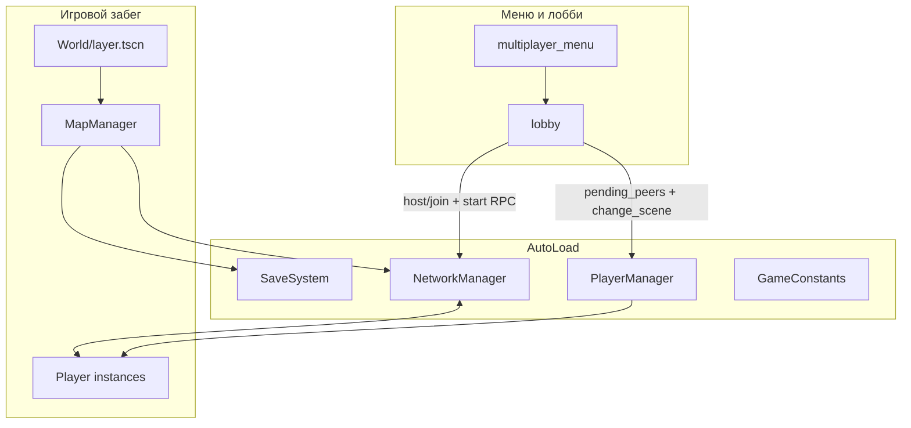

# Dungeon — архитектура проекта (материал для презентации)

Краткий технический обзор **Godot 4.4**, проект **Dungeon** (`config/name` в `project.godot`). Цель документа — дать структуру для слайдов «как устроено изнутри».

## Главный акцент для защиты и слайдов: **настоящий онлайн**

Это не «потом прикрутим сеть», а **центральная ось продукта**: полноценный **мультиплеер по ENet** с лобби, хостом как сервером, синхроном процедурного данжа у всех клиентов, общими переходами между этажами, авторитетным уроном и репликацией врагов. С точки зрения архитектуры **NetworkManager** и **PlayerManager** — такие же несущие автозагрузки, как сохранения и константы. Формулировка для слайда: *«Roguelike, в который реально можно зайти вдвоём–ввосьмером > вместе пройти один и тот же сгенерированный этаж > без рассинхрона карты и лута»*.

---

## 1. Стек и платформа

| Параметр | Значение |
|----------|----------|
| Движок | Godot 4.4 |
| Целевые фичи проекта | `4.4`, **Mobile** |
| Сеть | **ENet** (`ENetMultiplayerPeer`) — **реальный мультиплеер**, не hot-seat |
| Растягивание UI | `viewport` (базовый вьюпорт 540×260, переопределение окна до 1600×800) |
| Ввод | Клавиатура + мышь; `emulate_touch_from_mouse` для отладки тача |

---

## 2. Автозагрузки (singletons)

Центральные подсистемы подключаются как **AutoLoad** и задают «скелет» приложения:

- **GameConstants** — прогресс, статы игрока, размеры комнат/коридоров, баланс врагов; часть значений читается/пишется в `user://game_consts.cfg`.
- **SaveSystem** — `save_game.dat`, `dungeon_state.dat`, артефакты, люк босса, позиция/здоровье.
- **AudioManager** — звуковое сопровождение (SFX по событиям, например переход этажа).
- **NetworkManager** — ENet, RPC, синхрон данжа, кооп-переходы, урон, враги, артефакты.
- **PlayerManager** — словарь игроков по `peer_id`, спавн, финальная расстановка в стартовой комнате коопа, вспомогательная логика ИИ (ближайшая цель, телепорт в бой).
- **LocalizationManager** — локализация; в проекте подключены переводы **ru**, **en**, **az**.

**Архитектура «сервисов» (как формулировать жюри):** прогресс, сеть, звук и игроки **не размазаны по сценам**, а собраны в явных автозагрузках — проще сопровождать, тестировать и показывать на слайде «слои приложения».

**Игровой слой поверх сервисов:** основной мир — **сетка префаб-комнат** (`scene/room_variants/…`, база `RoomBase` где используется), **коридоры**, в каждой комнате контейнер **`Enemys`** (`scene/level/enemys.gd`), отдельные сцены врагов и боссов. Итог: топдаун-данжен с процедурной раскладкой этажа, ростом сложности, лутом и **опциональным коопом**, где хост — источник правды для боя и синхронизации мира.

На слайде: «сервисы в AutoLoad + одна игровая сцена слоя = единая точка правды для прогресса и сети».

---

## 3. Высокоуровневая схема потоков (онлайн в центре)

- **Лобби** (`World/UI/lobby.gd`): хост показывает **код комнаты** (кодирование локального IPv4), гость присоединяется; старт игры — RPC с списком пиров и снимком `GameConstants` для единого старта коопа.
- **Игра** (`World/layer.tscn`): содержит **MapManager**, который либо **генерирует** данж, либо **загружает** сохранённое состояние, либо на клиенте **ждёт синхрон** от хоста.

---

## 4. Процедурная генерация и автоген этажа (`World/map_manager.gd`)

Нода в группе `map_manager`. Ниже — логика «как в коде», удобная для технического слайда.

### 4.1. Сетка и алгоритм раскладки (`generate_layout`)

- Поле **`MAP_MANAGER_GRID_SIZE`** (по умолчанию **8×8** из `GameConstants`).
- Типы клеток: **START**, **NORMAL**, **BOSS**, **TREASURE**, пустые (**EMPTY**).
- **Старт** — в центре сетки.
- **Босс** — на «полосе» справа: `x = MAP_MANAGER_GRID_SIZE - 2`, **Y случайный** в допустимом диапазоне.
- От старта к боссу строится **цепочка нормальных комнат**: шаг в основном по **X** к боссу; с вероятностью **~30%** (если не выровнялись по Y с боссом) — смещение по **Y** — ветвление без однообразной «лесенки».
- Дополнительно **3–6** случайных **NORMAL**: от случайной нормальной комнаты в случайную сторону, если клетка пустая.
- **4–6 сокровищниц**: до **15** попыток; для каждой — случайная **NORMAL**, направления **перемешиваются**, ищется соседняя **EMPTY** — меньше шаблонного прилипания сокровищниц к одной стороне света.

### 4.2. Визуальная сборка (`draw_map`)

- Очистка старых узлов комнат, затем для каждой непустой клетки — **инстанс** случайной сцены из массивов вариантов (`start_room_variations`, `normal_room_variations`, …).
- У комнаты выставляются **`grid_x` / `grid_y`**, вызывается **`setup_room(...)`** с учётом соседей, вешаются **горизонтальные и вертикальные коридоры** (отдельные `PackedScene`).

### 4.3. Детерминизм и сейв

- При новом забеге: **`generation_seed`**, `seed(generation_seed)` — тот же seed даёт ту же раскладку.
- **`SaveSystem.save_dungeon_data`**: JSON-подобный словарь — seed, **детализация препятствий**, текущая комната, **посещённые / увиденные / зачищенные**, собранные сокровищницы и т.д.
- **Загрузка:** снова `generate_layout()` + `draw_map()` с тем же seed, восстановление списков, **удаление врагов из уже зачищенных** комнат, сброс колоды лута при необходимости, возврат в текущую комнату.

### 4.4. Препятствия (камни)

- Для каждой **обычной** комнаты свой RNG: **`rng.seed = hash(str(generation_seed) + "|obst|" + gx + "," + gy)`** — после синка seed в онлайне **камни совпадают** у всех.
- **`OBSTACLE_DETAIL_LEVEL`** (0 / половина / полный набор) — плотность; значение может прийти из **сейва данжа** (`obstacle_detail`), чтобы кооп не расходился по коллизиям.

### 4.5. Прочее

- **Враги и лут в сокровищницах**: спавн после физики; глобальная **колода** `item_draw_pile` (shuffle → `pop_back`, при опустошении — снова shuffle).
- **Миникарта / туман войны**: `room_changed`, `visited_rooms`, `seen_rooms` — слайд «ориентация без полной карты сразу».

**Сохранение данжа:** `user://dungeon_state.dat` через `SaveSystem`; при закрытии окна — автосейв (`NOTIFICATION_WM_CLOSE_REQUEST`).

**Сильная формулировка:** не просто «рандом комнат», а **воспроизводимый этаж + полный прогресс по комнатам** в одном пайплайне — удобно и соло, и для **передачи того же JSON клиентам в коопе**.

---

## 5. Сетевая модель (NetworkManager) — «бомба» проекта

Принцип: **хост = сервер** (authority `SERVER_ID == 1`), порт по умолчанию **4242**, до **`MAX_CLIENT_PEERS` = 7** гостей. Лобби: **HEX-код** из локального IPv4 (`encode_ip` / `decode_code`) — короткий код для копирования и диктовки. Клиенты получают состояние и RPC. Именно здесь сосредоточена большая часть «вау» для презентации: **один мир для всех**, а не локальная копия у каждого.

Ключевые зоны ответственности:

1. **Синхрон подземелья**  
   - `host_publish_dungeon_state()` — после генерации/загрузки на хосте рассылается **тот же JSON**, что пишется в `user://dungeon_state.dat`, плюс текущий этаж (`GameConstants.CURRENT_FLOOR`).  
   - Клиент: `client_wait_dungeon_ready()` (ожидание появления состояния), при сбое **`rpc_request_dungeon_resync`**.  
   - После получения — **`load_dungeon_state()`**: у всех **одинаковая геометрия и прогресс по комнатам**.

2. **Кооп-переход на следующий этаж**  
   - `rpc_coop_transition_next_floor` — **дебаунс по времени**, сброс люка, инкремент этажа, `change_scene_to_file` отложенно (`call_deferred`), чтобы избежать ошибок освобождения дерева сцен.

3. **Игроки**  
   - Урон / яд / отброс от врагов: **`NetworkManager.server_apply_*`** — на сервере решается итог; владельцу authority — локальный вызов, иначе **RPC на peer** (`rpc_take_damage_from_server` и т.д.). Клиент не «читерит» локальным уроном.

4. **Враги на клиентах**  
   - Хост в **`_physics_process`** шлёт **`rpc_sync_enemy_transform`** только для **текущей комнаты и соседей** по сетке; интервал в коде **`ENEMY_NET_SYNC_INTERVAL` ≈ 0.10 с** (~10 Гц), плюс **пропуск кадра**, если позиция/скорость почти не менялись (`_NET_SYNC_POS_EPS2`, `_NET_SYNC_VEL_EPS2`) — экономия трафика.  
   - Клиенты для врагов не гоняют полный ИИ: **`enemy_client_interpolate_if_needed`** — сглаживание к последнему сетевому состоянию (без полноценного `move_and_slide` на чужой машине).

5. **Урон по врагу от игрока**  
   - Офлайн: локально.  
   - Онлайн: на сервере сразу; клиент шлёт `rpc_request_enemy_damage`, затем реплика HP/смерти `rpc_sync_enemy_after_damage`.

6. **Зачистка комнаты (связка `scene/level/enemys.gd` → NetworkManager → MapManager)**  
   - При входе игрока в `room_shape` включается **агрессия**, переключение музыки **исследование / бой** (`AudioManager.play_combat`, для босса — **`play_boss(boss_type)`** по пути сцены).  
   - Когда последний враг убит: на сервер уходит RPC зачистки → **`apply_room_cleared_for_network`**: чистка врагов в комнате, на хосте **`GameConstants.on_room_cleared()`**, **`save_dungeon_state()`**, снова **`host_publish_dungeon_state()`** — новые клиенты и ресинк видят актуальное состояние.  
   - **Важный кейс зрелости:** в коопе на хосте **не делается `queue_free` босса** в этой ветке — узел **`boss`** пропускается, пока на нём отрабатывает **`death()`** (люк и лут). Иначе ломается сценарий награды.

7. **Прочее**  
   - Вход в комнату коопа, зеркалирование снарядов, лут босса, открытие люка, артефакты (подбор через сервер + зеркалирование), общий стейт после левелапа (`rpc_replicate_player_stats`).

На слайде (можно крупно): **«Мир (JSON + seed) vs бой (authority + RPC) vs урезанная реплика врагов vs отдельный пайплайн артефактов»** — выглядит как **законченный сетевой слой**, а не «мультиплеер на полдня».

---

## 6. PlayerManager и мультиплеер-спавн

- Сцена игрока: `scene/game_objects/player/player.tscn`; `multiplayer_authority` = id пира.
- Локальный игрок: `is_local_player = true`, группа `local_player` для наград/UX.
- После готовности карты: `finalize_network_spawns()` — ожидание физических кадров, точки `get_coop_spawn_points()` в стартовой комнате, проверка проходимости через `PhysicsShapeQueryParameters2D` (круг), кламп внутри `room_shape`.
- **Втягивание в бой**: `host_pull_co_players_into_combat_room` — если один игрок уже в зоне врагов, остальных сервер телепортирует рядом (безопасный raycast-спавн).

---

## 7. Физические слои (2D)

Из `project.godot` — именованные слои:

- world, player, enemy, pick_up, aggression, arrow  

Удобно для слайда «коллизии разделены по ролям».

---

## 8. Плагины и аддоны

- **AS2P** (`addons/AS2P`) — включён в редакторе (`editor_plugins`).
- **Virtual Joystick** (`addons/virtual_joystick`) + сцена `scene/button/mobile_controller.tscn` — позиции и масштаб джойстиков в `user://settings.cfg`, версия раскладки для миграций.

---

## 9. Группы сцен и узлов (для поиска в коде)

- `map_manager` — доступ к карте из сети и геймплея.  
- `player`, `local_player`, `enemies` / `enemys` (в коде встречаются оба варианта именования групп).  
- `backpack` — инвентарь артефактов и синхронизация с сейвом.

---

## 10. Файлы пользователя (персистентность)

| Файл | Назначение |
|------|------------|
| `user://save_game.dat` | Герой: статы, прогресс, HP, позиция, собранные артефакты |
| `user://dungeon_state.dat` | Этаж: seed, комнаты, посещения/туман, зачистки, сокровищницы, детализация препятствий |
| `user://game_consts.cfg` | Баланс (`[stats]`); в одиночке — периодическая перезагрузка для «горячей» подкрутки без пересборки |
| `user://settings.cfg` | Громкость, частицы, камни, **раскладка джойстиков** |

---

## 11. Идеи формулировок для слайдов (онлайн — первым номером)

1. **«Онлайн-кооп из коробки: до 8 человек в сессии (1 хост + 7 гостей), лобби и код комнаты.»**  
2. **«Один процедурный данж на всю патию: гости получают состояние с хоста, при сбое — ресинк.»**  
3. **«Сервер решает урон по игрокам и по врагам; клиенты видят плавную картинку за счёт интерполяции и RPC-снапшотов.»**  
4. «Синхрон смены этажа, люка босса, лута и артефактов — кооп чувствуется как один забег, а не два одиночных клиента.»  
5. «Процедурный данж с seed и сохранением этажа + мобильный ввод и три языка — широкая подача продукта.»  

---

## 12. Что сказать жюри как «уникальное целое»

Не каждая фича обязана быть уникальна для индустрии в отрыве; сильно смотрится **сочетание** для студенческого / хакатонного срока:

- **Воспроизводимая процедурка + полный сейв этажа + тот же JSON в коопе** — редко доводят до конца вместе.  
- **Авторитет сервера по урону и статусам + урезанный sync врагов + интерполяция** — понятная сетевая модель, не «RPC каждый кадр».  
- **Два слоя артефактов** (базовый подбор + data-driven pickup) и **кооп-подбор через хост** — заложено в дизайн классов.  
- **Два босса** с разной музыкой и механиками, **чередование** по `SaveSystem.last_spawned_boss_scene_path`, тематические пулы лута.  
- **Три языка** и **Mobile** как заявленная платформа.

---

*Документ синхронизирован с корневым `README.md` и кодом (`map_manager.gd`, `network_manager.gd`, `enemys.gd`). Детали артефактов и боссов для «продуктовых» слайдов — в `02-features-and-highlights.md`.*
